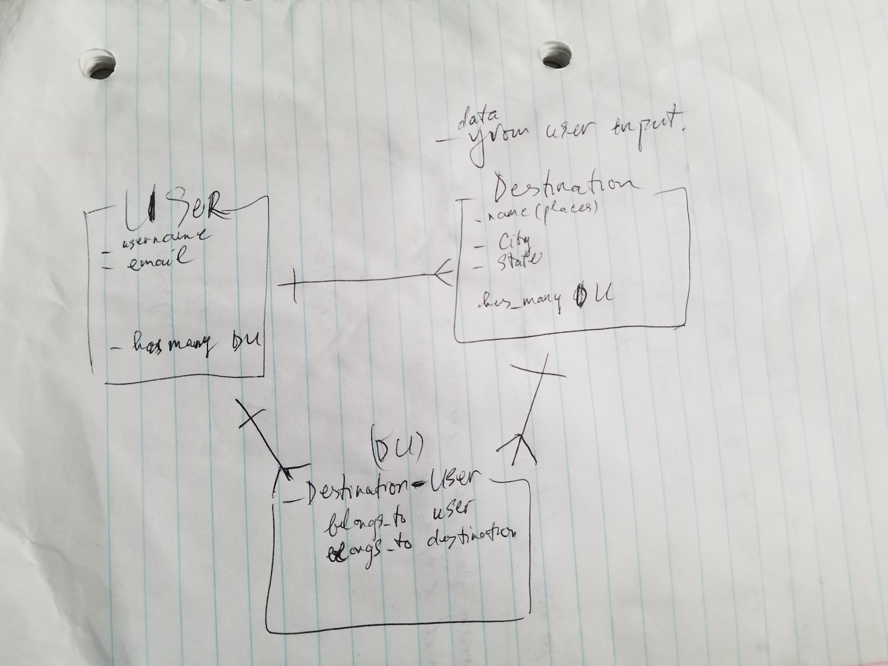

# Project 2 API using ruby
A travel app to help users keep track of their desired destinations. Users can edit/update, delete destination.
Building a one-to-many Entity Relation Diagram

## Github links:
back-end repo: https://github.com/TN-space/Project2-api \
deploy site: https://project-no2.herokuapp.com/destinations \
front-end repo: https://github.com/TN-space/Project2-front \
deploy site:https://tn-space.github.io/Project2-front

## Planning:

### User stories:

As a user want to be able to sign up.\
As a user want to be able to sign in.\
As a signed-in user want to be able to change password.\
As a signed-in user want to be able to sign out.\
As a signed-in user want to be able to create new destination.\
As a signed-in user want to be able to see all destinations.\
As a signed-in user want to be able to delete my destination.\
As a signed-in user want to be able to edit my destination.

### Technologies used:
Ruby on Rails

### Improvement:
Create destination_user joint table. One destination can have many users.\
Users can leave review, upload pictures, videos for their destination. And, can share with others

### Image:

#### Wireframe

